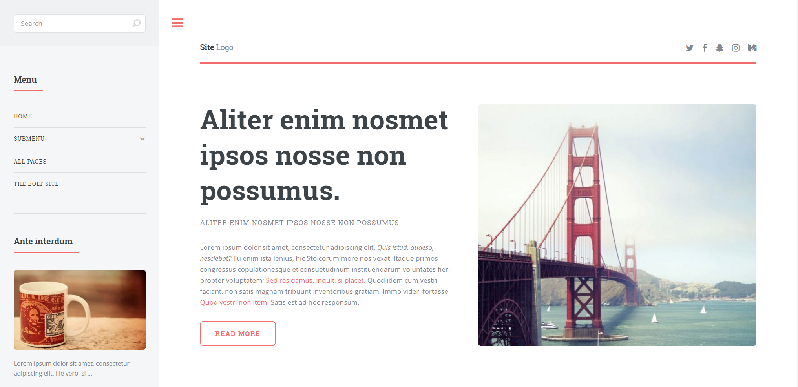

## Editorial by HTML5 UP

### Introduction

This is [Editorial by HTML5 UP](https://html5up.net/editorial) adapted for Bolt! See `README.txt` for notes by the original author of this theme.

**Note:**  This is a theme compatible for Bolt 3.

### Configuration

- Add the theme to the `config.yml` in the `theme: themeName` option. `themeName` is set to base-2016 by default on Bolt 3.

If you want to build extra templates reusing the components of this theme you can check the style guide. There are two options for doing this:

1. Go to `/styleguide` to see it in the browser.
2. You can look directly into the HTML in the `styleguide.twig` template.

Don't forget to clear yor cache every time you make changes.

Check the screenshots folder to discover more of this theme.
